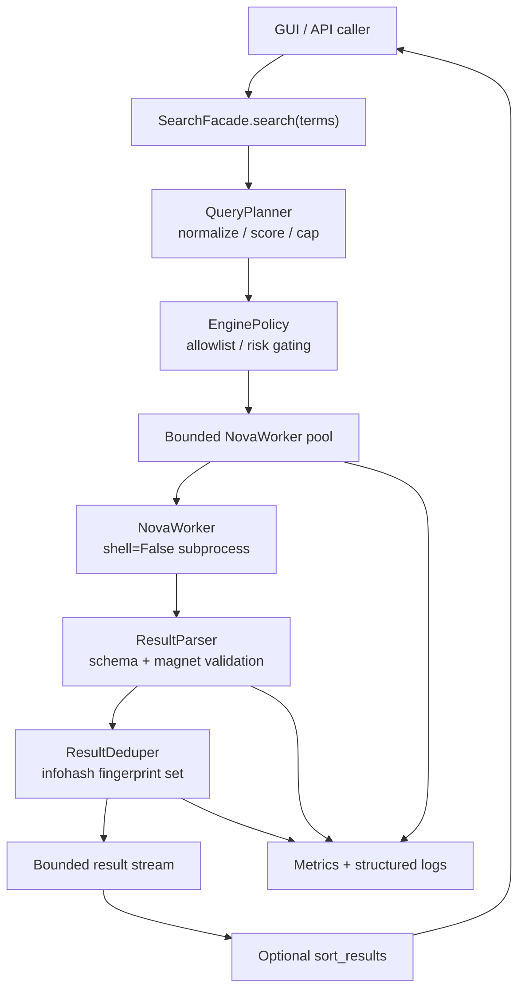

# `search_engines` - Torrent Search Subsystem

This package is the orchestration layer that turns a list of anime titles
into a stream of validated torrent results. It wraps the vendored
[qBittorrent nova3 search plugins](https://github.com/qbittorrent/search-plugins)
(stored under [`nova3/`](nova3)) with security, performance and
observability controls.

`nova3/` is treated as an **immutable, black-box dependency**. All of the
hardening lives in the modules described below; do not patch files inside
`nova3/`.

## Quick start

```python
from search_engines import search, search_strict, SearchFacade

# Legacy streaming API (used by the GUI). Yields dicts as results arrive.
for hit in search(["Tokyo Revengers", "東京リベンジャーズ"]):
    print(hit["name"], hit["seeds"], hit["link"])

# Strict, ranked, fully materialized API (used by the FastAPI server).
ranked = search_strict(["Tokyo Revengers"])

# Or build a custom orchestration with explicit policies/profiles.
facade = SearchFacade.for_profile("strict")
for hit in facade.search(["My Show"]):
    ...
```

All three call sites perform the same work:
plan -> filter by policy -> dispatch bounded worker pool -> parse ->
deduplicate -> stream or rank.

## Architecture overview



Each box maps to one module so the boundary is easy to keep clean:

| Module | Role |
| --- | --- |
| [`config.py`](config.py) | `SearchLimits`, `SearchProfile`, environment overrides |
| [`telemetry.py`](telemetry.py) | thread-safe metrics, structured logging |
| [`engine_policy.py`](engine_policy.py) + [`engine_policy.json`](engine_policy.json) | declarative engine trust policy |
| [`planner.py`](planner.py) | term normalization, scoring, capping |
| [`worker.py`](worker.py) | secure subprocess invocation + lifecycle |
| [`parser.py`](parser.py) | schema-validated `TorrentResult` records |
| [`dedupe.py`](dedupe.py) | fingerprint-based duplicate elimination |
| [`ranking.py`](ranking.py) | deterministic ordering for batch consumers |
| [`facade.py`](facade.py) | composition + public API |
| [`__init__.py`](__init__.py) | re-exports for callers |

## Profiles

A *profile* bundles the limits and policy flags that govern a single
request. Two are provided out of the box:

| | `interactive` | `strict` |
| --- | --- | --- |
| Intended caller | Tk GUI | FastAPI / public REST |
| `max_terms` | 12 | 4 |
| `max_concurrent_jobs` | 6 | 3 |
| `per_job_timeout_s` | 45 | 20 |
| `request_deadline_s` | 120 | 45 |
| `max_results_per_term` | 50 | 40 |
| Insecure-TLS engines | blocked | blocked |
| No-timeout engines | allowed | blocked |
| NSFW engines | allowed | blocked |
| Result ordering | streaming (arrival order) | batched & ranked |

Each planned search term may contribute up to ``max_results_per_term``
rows. There is no separate global row ceiling — totals scale with the
number of terms.

Override any limit at runtime through environment variables prefixed
`ANIME_SEARCH_<PROFILE>_<FIELD>`, e.g.
`ANIME_SEARCH_STRICT_MAX_RESULTS_PER_TERM=50` (legacy
`ANIME_SEARCH_*_MAX_RESULTS` is still accepted as an alias).

To author a new profile, build a `SearchProfile` from `config.py` and
pass it to `SearchFacade`:

```python
from search_engines import SearchFacade, SearchProfile, SearchLimits

profile = SearchProfile(
    name="background-prefetch",
    limits=SearchLimits(max_terms=2, request_deadline_s=15),
    allow_insecure_engines=False,
    allow_no_timeout_engines=False,
    rank_results=True,
)
facade = SearchFacade(profile=profile)
```

## Engine trust policy

Engines are listed in [`engine_policy.json`](engine_policy.json) with the
following keys:

```json
{
  "enabled": true,
  "risk_level": "low|medium|high",
  "anime_relevant": true,
  "requires_insecure_tls": false,
  "missing_timeout": false,
  "nsfw": false,
  "notes": "optional human description"
}
```

`EnginePolicy.filter()` drops any candidate whose flags conflict with the
active profile and emits an `engine_filtered` structured log entry with a
`reason=` code. The defaults intentionally disable:

* `limetorrents`, `smallgames` - patch the global SSL context to skip
  certificate verification, so they are unsafe to call from this process.
* `pctmix`, `pctfenix` - issue `urllib.request.urlopen` without a
  timeout and can hang an entire pool slot.
* `sukebei`, `sukebeisi` - NSFW catalogues; opt-in only.

To enable or quarantine an engine, edit the JSON file - no code change is
required. The cached policy can be reloaded in tests via
`engine_policy.reset_default_policy()`.

## Result schema

Each yielded dict matches the legacy nova3 output, plus an additive
`infohash` field that downstream consumers can use for deduplication:

```python
{
    "link": "magnet:?xt=urn:btih:...",
    "name": "Tokyo Revengers - 01 [1080p]",
    "size": 1073741824,              # bytes (int)
    "seeds": 120,                    # int >= 0
    "leech": 5,                      # int >= 0
    "engine_url": "https://nyaa.si",
    "desc_link": "https://nyaa.si/view/...",
    "infohash": "0123456789abcdef...",
}
```

`SearchFacade.search_results()` returns the richer
[`TorrentResult`](parser.py) dataclass for callers that want immutable
records instead of dicts.

## Security posture

The legacy implementation built shell command strings such as
`f'python -m nova3.nova2 all anime "{term}"'` and ran them with
`shell=True`. The new pipeline preserves all anime functionality while
enforcing the following invariants:

* **No shell interpretation.** `NovaWorker` spawns
  `[sys.executable, "-m", "nova3.nova2", engines, category, term]` with
  `shell=False`. The query is always a single `argv` element, so newlines,
  backticks, `$()` and friends cannot escape it.
* **Bounded process tree.** Each request runs inside a request-level
  deadline and per-job timeout, with hard `terminate` -> `kill`
  escalation.
* **Bounded I/O.** Per-line and per-job stdout caps stop runaway children
  from pinning memory.
* **Strict input validation.** The planner strips control characters,
  rejects degenerate or oversize terms and enforces NFKC normalization.
* **Strict output validation.** The parser enforces a magnet URI shape,
  coerces numeric fields safely and drops anything that does not match.
* **Policy-driven engine gating.** Insecure-TLS or no-timeout engines are
  disabled by default and never reach `NovaWorker`.

Run the security regression suite with:

```bash
pytest tests/security/test_search_security.py -q
```

## Performance posture

* **Subprocess fan-out is capped.** `QueryPlanner` keeps the most
  discriminative N terms (default 8 interactive / 4 strict). One nova3
  subprocess is spawned per planned term; engines are batched into the
  same invocation.
* **Bounded concurrency.** A `threading.BoundedSemaphore` enforces
  `max_concurrent_jobs` across all worker threads.
* **O(1) dedupe.** `ResultDeduper` uses a `set` of fingerprints; the
  legacy `list`-based `ItemList.ids` was migrated to a set too.
* **Backpressure-aware streaming.** Workers push into a bounded
  `queue.Queue`; if the consumer stalls, the queue drops *newest* items
  with a counter rather than risking memory growth.

The performance suite (`tests/performance/test_search_performance.py`)
codifies these invariants and is fast enough to run in CI.

## Telemetry

`telemetry.get_metrics()` returns a thread-safe `Metrics` object with two
maps:

* `counters` - integers (e.g. `parser_dropped_non_magnet`,
  `worker_timeout`, `dedupe_dropped`).
* `timings_ms` - cumulative wall-clock millisecond counters.

Structured log records are emitted via the project's `log()` function
when available. Notable events:

| Event | Emitted by | Useful fields |
| --- | --- | --- |
| `request_start` | facade | `terms_in`, `terms_planned`, `engines` |
| `engine_filtered` | engine policy | `engine`, `reason` |
| `worker_finished` | worker | `term_len`, `duration_ms`, `rows`, `bytes`, `exit_reason`, `exit_code` |
| `request_done` | facade | `duration_ms`, `results`, `timeouts`, `jobs` |

All records include a short `rid=` correlation id so a single search can
be traced end-to-end across worker threads.

## How to extend the pipeline

* **Add a new engine.** Drop the file under `nova3/engines/` (vendor
  patch only), then add an entry to `engine_policy.json`. No code
  changes elsewhere.
* **Add a new profile.** Create a `SearchProfile` constant in
  `config.py` and expose it via `__init__.py`.
* **Change result ordering.** Replace or extend `ranking.sort_results`.
  The facade calls it once, when `profile.rank_results=True`.
* **Add a new metric.** Call `get_metrics().incr("my_metric")` anywhere
  inside the pipeline. Metrics are global and thread-safe.

## How to test

```bash
# Full new subsystem (unit + integration + security + performance):
pytest tests/unit/search_engines tests/security/test_search_security.py \
       tests/performance/test_search_performance.py -q

# Just the security regression suite:
pytest tests/security/test_search_security.py -q

# Just the planner / parser / dedupe unit tests:
pytest tests/unit/search_engines/test_planner.py \
       tests/unit/search_engines/test_parser.py \
       tests/unit/search_engines/test_dedupe.py -q
```

Tests never spawn real `nova3` subprocesses; they inject a fake process
runner through `monkeypatch.setattr("search_engines.worker._ProcessRunner.spawn", ...)`.

## Maintenance notes

* The legacy stand-alone parsers (`anirena.py`, `nyaasi.py`,
  `tokyotosho.py`, `template.py`, `parserUtils.py`) that lived at the
  top of this package were dead code and have been removed. Use the
  orchestrated pipeline above for all new work.
* `nova3/custom_engine.py` and `nova3/nova2dl.py` are alternate vendor
  entry points that are not wired into the application today. They are
  left untouched because `nova3/` is vendored.
* If you must inspect or replace `nova3`, do it by version-bumping the
  whole folder from upstream rather than editing files in place.
